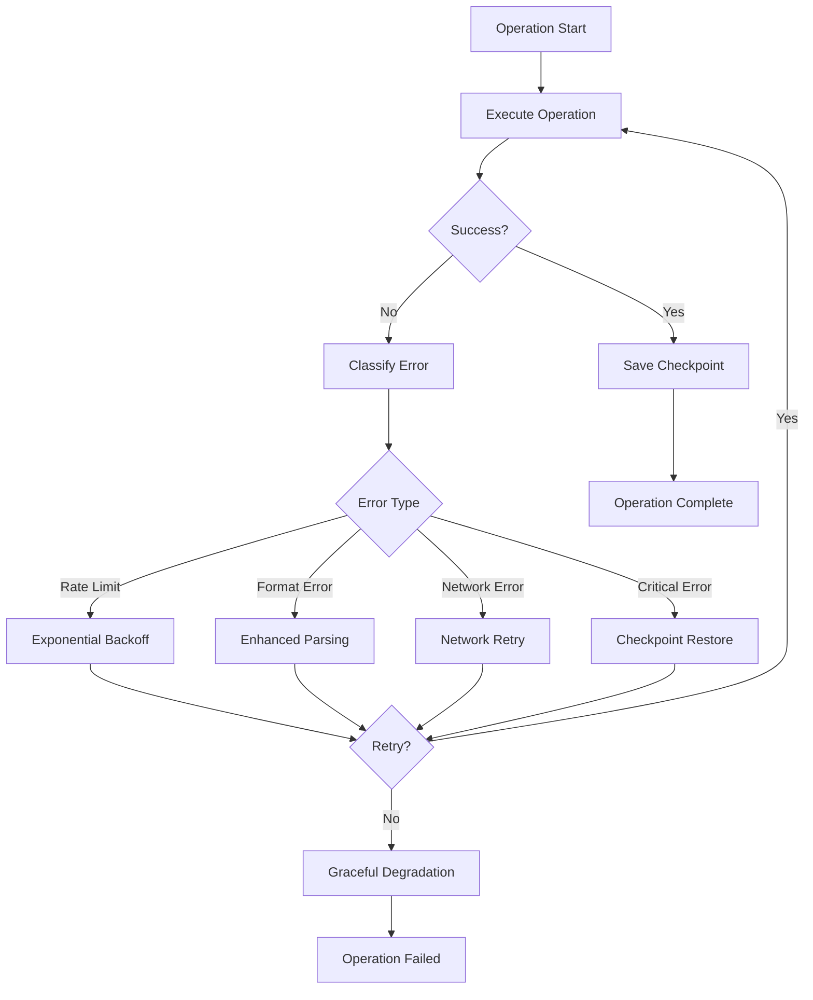

# Advanced Error Handling and Recovery System

This document describes the comprehensive error handling and recovery system implemented for the advanced prompt optimizer.

## Overview

The advanced error handling system provides robust error recovery capabilities through multiple layers of protection:

1. **Advanced Parsing Handler** - Multiple parsing strategies with intelligent recovery
2. **API Error Handler** - Sophisticated retry logic with adaptive strategies  
3. **Checkpoint Manager** - Progress saving and recovery mechanisms
4. **Error Recovery System** - Integrated recovery orchestration

## Components

### 1. AdvancedParsingHandler

The `AdvancedParsingHandler` provides multiple parsing strategies to handle malformed API responses.

#### Key Features

- **Multiple Parsing Strategies**: 9 different parsing approaches tried in order of preference
- **Intelligent Recovery**: Context-aware parsing using surrounding text clues
- **Enhanced Format Recovery**: Automatic response format correction
- **Partial Result Extraction**: Recovers usable data from partially malformed responses

#### Parsing Strategies

1. **Standard Format**: `1. 사실형,긍정,현재,확실`
2. **Numbered List**: Flexible numbering with various separators
3. **JSON Format**: Handles JSON-formatted responses
4. **Comma Separated**: Pure CSV-style parsing
5. **Line by Line**: Flexible separator detection
6. **Regex Extraction**: Pattern-based extraction
7. **Fuzzy Matching**: Approximate term matching
8. **Intelligent Recovery**: ML-like pattern recognition
9. **Context Aware**: Uses surrounding text for context

#### Usage Example

```python
from services.advanced_parsing_handler import AdvancedParsingHandler

handler = AdvancedParsingHandler()

# Try multiple parsing strategies
response = "1. 사실형 긍정 현재 확실\n2 추론형부정과거불확실"
result = handler.try_multiple_parsing_strategies(response)

# Enhanced format recovery
enhanced = handler.enhance_response_format_recovery(response, "parsing_error")

# Partial result extraction
partial = handler.extract_partial_results(response)
print(f"Confidence: {partial.confidence}, Items: {len(partial.parsed_items)}")
```

### 2. APIErrorHandler

The `APIErrorHandler` provides sophisticated retry logic with adaptive strategies.

#### Key Features

- **Exponential Backoff**: Intelligent delay calculation with jitter
- **Adaptive Retry Strategies**: Adjusts approach based on error patterns
- **Circuit Breaker**: Prevents cascading failures
- **Error Classification**: Categorizes errors for appropriate handling
- **Response Format Recovery**: Attempts to fix malformed responses

#### Error Types

- **Rate Limit**: API quota/rate limit exceeded
- **Network**: Connection, timeout, DNS issues
- **Temporary**: Server errors, service unavailable
- **Format**: Invalid response format
- **Unknown**: Unclassified errors

#### Usage Example

```python
from services.api_error_handler import APIErrorHandler

handler = APIErrorHandler(max_retries=5)

# Handle response format error
result = handler.handle_response_format_error(malformed_response, retry_count=1)

# Get adaptive retry strategy
strategy = handler.adaptive_retry_strategy("rate_limit", 2, error_history)

# Use decorator for automatic retry
@with_retry(max_retries=3)
def api_call():
    # Your API call here
    pass
```

### 3. CheckpointManager

The `CheckpointManager` handles progress saving and recovery.

#### Key Features

- **Automatic Checkpointing**: Saves progress at regular intervals
- **Incremental Checkpoints**: Updates only changed fields
- **Progress Tracking**: Operation-specific progress saving
- **Statistics**: Comprehensive checkpoint analytics
- **Cleanup**: Automatic old checkpoint removal

#### Checkpoint Data Structure

```python
@dataclass
class CheckpointData:
    timestamp: float
    iteration: int
    current_prompt: str
    best_score: float
    best_prompt: str
    optimization_history: List[Dict[str, Any]]
    error_count: int
    last_error: Optional[str]
    strategy_state: Dict[str, Any]
    progress_percentage: float
```

#### Usage Example

```python
from services.checkpoint_manager import CheckpointManager

manager = CheckpointManager(checkpoint_dir="checkpoints")

# Create checkpoint
checkpoint = manager.create_checkpoint(
    iteration=5,
    current_prompt="optimized prompt",
    best_score=0.85,
    best_prompt="best prompt so far",
    optimization_history=[],
    progress_percentage=75.0
)

# Save checkpoint
manager.save_checkpoint(checkpoint, force=True)

# Load latest checkpoint
loaded = manager.load_latest_checkpoint()

# Get statistics
stats = manager.get_checkpoint_statistics()
```

### 4. ErrorRecoverySystem

The `ErrorRecoverySystem` orchestrates all error handling components.

#### Key Features

- **Integrated Recovery**: Combines all error handling strategies
- **Adaptive Strategies**: Learns from error patterns
- **Progress Preservation**: Saves state during failures
- **Comprehensive Reporting**: Detailed system health monitoring
- **Graceful Degradation**: Reduces functionality under stress

#### Recovery Strategies

1. **API Retry**: For network and rate limit errors
2. **Enhanced Parsing Recovery**: For format errors
3. **Progressive Checkpoint Restore**: For critical failures
4. **Intelligent Circuit Breaker**: For cascading failures
5. **Adaptive Graceful Degradation**: For persistent issues

#### Usage Example

```python
from services.error_recovery_system import ErrorRecoverySystem, with_error_recovery

# Initialize system
recovery_system = ErrorRecoverySystem(checkpoint_dir="checkpoints")

# Execute operation with recovery
result = recovery_system.execute_with_recovery(
    operation=my_function,
    operation_name="optimization_step",
    context={"prompt": "test", "iteration": 5},
    max_attempts=5
)

# Use decorator
@with_error_recovery("my_operation", max_attempts=3)
def my_operation():
    # Your operation here
    pass

# Get system report
report = recovery_system.get_comprehensive_system_report()
```

## Error Recovery Flow



## Configuration

### Environment Variables

```bash
# Checkpoint settings
CHECKPOINT_DIR=checkpoints
AUTO_SAVE_INTERVAL=300

# API error handling
MAX_RETRIES=5
BASE_DELAY=1.0
MAX_DELAY=300.0
BACKOFF_MULTIPLIER=2.0

# Circuit breaker
ERROR_THRESHOLD=10
TIME_WINDOW=300
```

### Initialization

```python
# Initialize with custom settings
recovery_system = ErrorRecoverySystem(
    checkpoint_dir="custom_checkpoints",
    max_retries=10
)

# Configure API handler
api_handler = APIErrorHandler(
    max_retries=5,
    base_delay=2.0,
    max_delay=600.0
)

# Configure checkpoint manager
checkpoint_manager = CheckpointManager(
    checkpoint_dir="checkpoints",
    auto_save_interval=180  # 3 minutes
)
```

## Best Practices

### 1. Error Handling

- Always use the error recovery system for critical operations
- Implement proper error classification in your code
- Use appropriate retry strategies for different error types
- Monitor error patterns and adjust strategies accordingly

### 2. Checkpointing

- Save checkpoints at logical operation boundaries
- Use incremental checkpoints for frequent updates
- Clean up old checkpoints regularly
- Monitor checkpoint storage usage

### 3. Performance

- Use circuit breakers to prevent cascading failures
- Implement graceful degradation for non-critical features
- Monitor system health metrics
- Adjust retry parameters based on system performance

### 4. Monitoring

- Regularly check comprehensive system reports
- Monitor error rates and recovery effectiveness
- Track checkpoint statistics and trends
- Set up alerts for critical system health issues

## Troubleshooting

### Common Issues

1. **High Error Rates**
   - Check API configuration and credentials
   - Verify network connectivity
   - Review error patterns in logs
   - Adjust retry parameters

2. **Parsing Failures**
   - Review response format requirements
   - Check for API response changes
   - Verify classification term validity
   - Enable enhanced parsing recovery

3. **Checkpoint Issues**
   - Check disk space and permissions
   - Verify checkpoint directory configuration
   - Review checkpoint cleanup settings
   - Monitor checkpoint file integrity

4. **Performance Degradation**
   - Check circuit breaker activation
   - Review retry delay settings
   - Monitor system resource usage
   - Analyze error recovery patterns

### Debugging

Enable detailed logging:

```python
import logging
logging.getLogger("gemini_optimizer").setLevel(logging.DEBUG)
```

Check system status:

```python
status = recovery_system.get_system_status()
print(f"System health: {status['system_health']}")
```

Generate comprehensive report:

```python
report = recovery_system.get_comprehensive_system_report()
print(json.dumps(report, indent=2, ensure_ascii=False))
```

## Testing

Run the test suite:

```bash
python test_error_handling.py
python test_enhanced_error_handling.py
python examples/advanced_error_recovery_demo.py
```

## Performance Metrics

The system tracks various performance metrics:

- **Error Rate**: Percentage of operations that fail
- **Success Rate**: Percentage of operations that succeed
- **Recovery Effectiveness**: Percentage of errors successfully recovered
- **Checkpoint Frequency**: Rate of checkpoint creation
- **Average Score**: Mean performance score across checkpoints
- **Score Trend**: Direction of performance change

## Integration

The error handling system integrates with:

- Gemini API clients
- Prompt optimization workflows
- Performance monitoring systems
- Logging and alerting infrastructure

For integration examples, see the `examples/` directory.