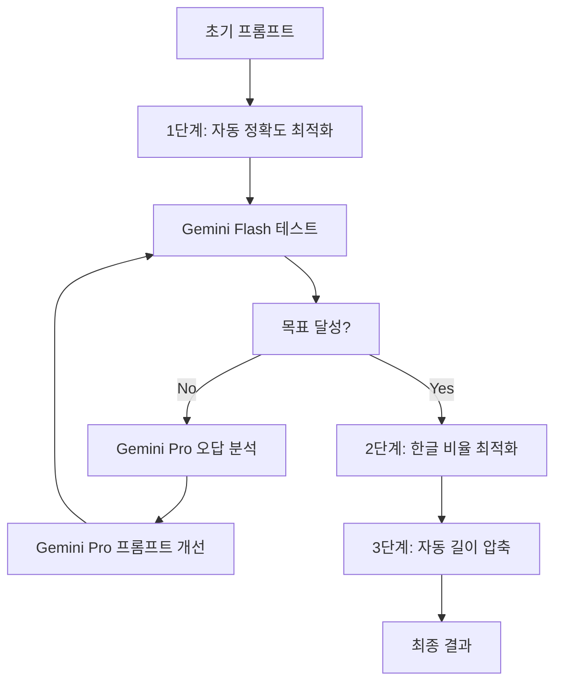

# 🤖 자동화된 프롬프트 최적화 시스템 가이드

## 개요

KT 해커톤을 위한 자동화된 프롬프트 최적화 시스템입니다. Gemini 2.5 Pro의 지능적 분석 능력을 활용하여 프롬프트를 자동으로 개선합니다.

## 🎯 핵심 기능

### 1. 자동화된 정확도 최적화
- **Gemini 2.5 Flash**로 정확도 테스트
- **Gemini 2.5 Pro**로 오답 패턴 분석
- **Gemini 2.5 Pro**로 개선된 프롬프트 생성
- 목표 달성까지 자동 반복

### 2. 지능적 길이 압축
- 핵심 내용 보존하면서 길이 단축
- 정확도 손실 최소화
- 3000자 제한 준수

### 3. 종합 모니터링 및 리포트
- 실시간 성능 추적
- 상세한 최적화 리포트
- 시각화된 진행 상황

## 🚀 사용법

### 기본 사용법
```bash
# 기본 3단계 최적화
python kt_hackathon_cli.py optimize --prompt your_prompt.txt

# 자동화된 최적화 (Gemini Pro 기반)
python kt_hackathon_cli.py optimize --prompt your_prompt.txt --auto

# 목표 점수 설정
python kt_hackathon_cli.py optimize --prompt your_prompt.txt --auto --target 0.95
```

### 주요 옵션
- `--prompt`: 초기 프롬프트 파일 경로 (필수)
- `--auto`: 자동화된 최적화 사용
- `--target`: 목표 KT 점수 (기본값: 0.9)
- `--samples`: 샘플 데이터 경로 (기본값: data/samples.csv)
- `--output`: 출력 디렉토리 (기본값: prompt/gemini)

## 📊 최적화 프로세스

### 자동화된 3단계 최적화



### 1단계: 자동 정확도 최적화
1. **테스트**: Gemini 2.5 Flash로 현재 정확도 측정
2. **분석**: Gemini 2.5 Pro로 오답 패턴 분석
3. **개선**: Gemini 2.5 Pro로 개선된 프롬프트 생성
4. **반복**: 목표 정확도 달성까지 자동 반복

### 2단계: 한글 비율 최적화
- 영어 표현을 한글로 번역
- 90% 이상 한글 비율 목표
- 의미 보존하면서 자연스러운 한글화

### 3단계: 자동 길이 압축
- Gemini 2.5 Pro의 지능적 압축
- 핵심 내용 보존
- 정확도 손실 최소화 (5% 이내)

## 📈 성능 모니터링

### KT 점수 공식
```
KT 점수 = 0.8 × 정확도 + 0.1 × 한글비율 + 0.1 × 길이점수
```

### 실시간 모니터링
- 각 단계별 점수 변화 추적
- 시각화된 진행 상황
- 개선 우선순위 제안

### 자동 리포트 생성
- 종합 최적화 리포트
- 반복별 상세 기록
- 성능 분석 및 개선 제안

## 🔧 고급 설정

### API 할당량 관리
```python
# config.py에서 설정
GEMINI_PRO_MAX_REQUESTS_PER_MINUTE = 2  # 무료 티어 제한
GEMINI_FLASH_MAX_REQUESTS_PER_MINUTE = 15
```

### 최적화 파라미터 조정
```python
# 정확도 최적화
target_accuracy = 0.8
max_iterations = 10

# 길이 압축
target_length = 3000
max_accuracy_loss = 0.05
```

## 📁 출력 파일

### 자동 생성 파일들
```
prompt/auto_optimized/
├── auto_optimized_v1.txt          # 1차 개선 프롬프트
├── auto_optimized_v2.txt          # 2차 개선 프롬프트
├── ...
├── final_optimized_YYYYMMDD_HHMMSS.txt    # 최종 프롬프트
├── optimization_history_YYYYMMDD_HHMMSS.json  # 최적화 히스토리
├── optimization_report_YYYYMMDD_HHMMSS.md     # 종합 리포트
└── summary_YYYYMMDD_HHMMSS.json              # 요약 정보
```

### 리포트 내용
- 반복별 정확도 변화
- 오답 패턴 분석
- 개선 제안사항
- 성능 시각화
- 최종 결과 요약

## 🎯 최적화 전략

### 정확도 개선 전략
1. **Few-shot Learning**: 효과적인 예시 추가
2. **Chain-of-Thought**: 단계별 추론 과정 명시
3. **규칙 명확화**: 애매한 기준을 구체적으로 개선
4. **오답 패턴 해결**: 반복되는 실수 유형 집중 개선

### 한글화 전략
1. **자연스러운 번역**: 의미 보존하면서 한글화
2. **전문용어 처리**: 적절한 한글 전문용어 사용
3. **문체 통일**: 일관된 한글 문체 유지

### 길이 압축 전략
1. **중복 제거**: 반복되는 내용 통합
2. **핵심 보존**: 분류 성능에 중요한 부분 유지
3. **간결한 표현**: 불필요한 수식어 제거

## 🚨 주의사항

### API 할당량
- Gemini Pro: 분당 2회 (무료 티어)
- Gemini Flash: 분당 15회
- 할당량 초과 시 자동 대기

### 성능 고려사항
- 자동 최적화는 시간이 오래 걸릴 수 있음
- 네트워크 상태에 따라 성능 변동 가능
- 캐싱을 활용하여 중복 요청 방지

### 데이터 품질
- 샘플 데이터 품질이 최적화 결과에 영향
- 충분한 양의 다양한 샘플 필요
- 라벨링 정확도 중요

## 🔍 문제 해결

### 일반적인 문제들

#### 1. API 할당량 초과
```
Error: API quota exceeded
```
**해결방법**: 잠시 대기 후 재시도 또는 유료 플랜 사용

#### 2. 정확도 개선 안됨
**원인**: 데이터 품질, 프롬프트 복잡도
**해결방법**: 샘플 데이터 검토, 더 많은 반복 수행

#### 3. 길이 압축 실패
**원인**: 이미 최적화된 프롬프트
**해결방법**: 압축 목표 조정 또는 건너뛰기

### 로그 확인
```bash
# 상세 로그 확인
tail -f logs/optimization.log

# 특정 오류 검색
grep "ERROR" logs/optimization.log
```

## 📚 추가 자료

- [KT 점수 계산기 가이드](KT_SCORE_GUIDE.md)
- [프롬프트 엔지니어링 베스트 프랙티스](PROMPT_ENGINEERING.md)
- [API 참조 문서](API_REFERENCE.md)
- [문제 해결 가이드](TROUBLESHOOTING.md)

## 🤝 기여하기

개선 제안이나 버그 리포트는 언제든 환영합니다!

1. 이슈 등록
2. 개선 제안
3. 코드 기여
4. 문서 개선

---

*자동화된 프롬프트 최적화 시스템으로 KT 해커톤에서 최고의 성과를 달성하세요!* 🚀